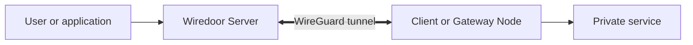

<p align="center">
  <picture>
    <source media="(prefers-color-scheme: dark)" srcset="https://www.wiredoor.net/images/wiredoor-large-dark.svg">
    
  </picture>
</p>

<p align="center">
  <strong>Self-hosted ingress for HTTP, TCP, and UDP services on private networks.</strong>
</p>

<p align="center">
  <a href="https://www.wiredoor.net/documentation">Documentation</a> |
  <a href="https://www.wiredoor.net/documentation/quickstart">Quickstart</a> |
  <a href="https://github.com/wiredoor/wiredoor-cli">Wiredoor CLI</a> |
  <a href="https://charts.wiredoor.net">Helm Charts</a>
</p>

<div align="center">

[](https://github.com/wiredoor/wiredoor/actions)
[](https://github.com/wiredoor/wiredoor/releases)
[](https://github.com/wiredoor/wiredoor-cli/releases)
[](https://hub.docker.com/r/wiredoor/wiredoor)
[](https://github.com/wiredoor/wiredoor/blob/main/LICENSE)

</div>

## What Is Wiredoor?

Wiredoor is an open-source, self-hosted ingress platform for exposing applications and services from private networks. Remote nodes initiate encrypted WireGuard tunnels to Wiredoor Server, so private services can remain behind NAT or a firewall without accepting direct inbound connections.

Wiredoor Server provides the public or internal entry point, manages nodes and domains, terminates HTTP TLS connections, and routes traffic through NGINX. You retain control of the server, network paths, configuration, and operational data.

## Who Wiredoor Is For

Wiredoor is designed for developers and infrastructure operators who need to publish or remotely access services running in:

- Home labs and private LANs.
- On-premises servers and restricted networks.
- Docker Compose environments.
- Private Kubernetes clusters.
- IoT and industrial networks.

It is a practical fit when you want to own the public entry point, tunnel, routing configuration, and operational data instead of depending on a hosted tunneling service.

## How Wiredoor Works



- Wiredoor Server receives HTTP, TCP, or UDP traffic and selects the configured route.
- A Client Node exposes a service running on the same Linux, Windows, or macOS computer.
- A Gateway Node provides access to approved services in a Docker network, Kubernetes cluster, or private subnet.
- The node initiates the WireGuard connection, so the private network does not need to accept a public inbound VPN connection.

Read [How Wiredoor Works](https://www.wiredoor.net/documentation/usage/how-wiredoor-works) for the complete request flow and component responsibilities.

## Features

- HTTP, TCP, and UDP service exposure.
- Encrypted WireGuard tunnels initiated from private nodes.
- NGINX routing for domains, paths, and public ports.
- Automatic Let's Encrypt certificates for eligible public domains.
- Self-signed certificates for local and internal domains.
- OAuth2 authentication and IP-based access restrictions.
- WebSocket support for HTTP services.
- Web dashboard and CLI management.
- Client Nodes for Linux, Windows, and macOS.
- Gateway Nodes for Docker networks, Kubernetes clusters, and private subnets.
- Optional Prometheus metrics and Grafana dashboards.

## Choose a Node Type

| Node type          | Where it runs                           | Use it when                                                      |
| ------------------ | --------------------------------------- | ---------------------------------------------------------------- |
| Client Node        | Linux, Windows, or macOS                | The private service runs on the same computer as Wiredoor CLI.   |
| Linux Gateway Node | Linux                                   | One node must route to several services in an approved subnet.   |
| Docker Gateway     | Linux, Windows, or macOS through Docker | Services run in Docker or a private network reachable by Docker. |
| Kubernetes Gateway | Kubernetes through the official chart   | Services are reached through Kubernetes networking and DNS.      |

Gateway routing depends on Linux `iptables` rules. Native Wiredoor CLI installations on Windows and macOS support Client Node mode. To run a local Gateway Node on either system, use [Wiredoor Docker Gateway through Docker Desktop](https://www.wiredoor.net/documentation/gateways/docker).

## Quickstart

The complete [Wiredoor quickstart](https://www.wiredoor.net/documentation/quickstart) explains every step and includes CLI installation instructions for Linux, Windows, and macOS. The condensed journey is shown below.

### Requirements

- A reachable Linux server with Docker Engine, Docker Compose, and Git.
- TCP ports `80` and `443` open on Wiredoor Server.
- UDP port `51820` open on Wiredoor Server, unless you configure another VPN port.
- An existing private HTTP service to expose.
- A public domain, internal DNS name, or local hosts entry for the service.

### 1. Install Wiredoor Server

Clone the official Docker setup:

```bash
git clone https://github.com/wiredoor/docker-setup.git
cd docker-setup
cp .env.example .env
```

Open `.env` with your preferred text editor and configure the administrator credentials, public VPN hostname or IP address, VPN port, and VPN subnet. Then start Wiredoor:

```bash
docker compose up -d
docker compose ps wiredoor
```

Open the Wiredoor Server address in your browser and sign in with the administrator credentials from `.env`.

### 2. Connect a Client Node

Follow the [Wiredoor CLI installation instructions](https://www.wiredoor.net/documentation/quickstart#install-the-wiredoor-cli) for the operating system that runs your private service. Then register the Client Node:

```bash
wiredoor login --url https://wiredoor.example.com
wiredoor status
```

Replace the example URL with the domain or IP address of your Wiredoor Server.

### 3. Expose a Private Service

The following example exposes an existing HTTP service running on port `3000`:

```bash
wiredoor http first-app --domain app.example.com --port 3000
```

Open `https://app.example.com` and confirm that the private application responds through Wiredoor.

### Public DNS Is Optional

Wiredoor does not require a public domain. You can use an internal DNS name or define a local domain in `/etc/hosts`, the Windows hosts file, or the equivalent hosts file on macOS. Public domains are useful when the service needs a publicly trusted Let's Encrypt certificate.

Read [Use Wiredoor Without Public DNS](https://www.wiredoor.net/documentation/usage/domains-and-dns#use-wiredoor-without-public-dns) for examples and certificate considerations.

## Gateway Deployments

### Docker Gateway

Wiredoor Docker Gateway can expose containers on a shared Docker network or services in a private subnet reachable from the gateway container. It also provides a local Linux Gateway environment through Docker Desktop on Windows and macOS.

[Configure Wiredoor Docker Gateway](https://www.wiredoor.net/documentation/gateways/docker)

### Kubernetes Gateway

Wiredoor Kubernetes Gateway connects a cluster to Wiredoor Server and routes approved traffic to Kubernetes Services through cluster networking and DNS.

[Configure Wiredoor Kubernetes Gateway](https://www.wiredoor.net/documentation/gateways/kubernetes)

## Optional Monitoring

Prometheus and Grafana are optional integrations. Wiredoor works without them, including nodes, tunnels, domains, certificates, access controls, and HTTP, TCP, or UDP service exposure.

Enable the monitoring stack only when you want historical metrics and Grafana dashboards for NGINX traffic and WireGuard peers.

[Monitor Wiredoor with Prometheus and Grafana](https://www.wiredoor.net/documentation/operations/monitoring)

## Documentation

| Topic                | Documentation                                                                                                         |
| -------------------- | --------------------------------------------------------------------------------------------------------------------- |
| Getting started      | [Install Wiredoor and expose a private service](https://www.wiredoor.net/documentation/quickstart)                    |
| Architecture         | [Understand Wiredoor components and traffic flow](https://www.wiredoor.net/documentation/usage/how-wiredoor-works)    |
| Nodes                | [Configure Client Nodes and Gateway Nodes](https://www.wiredoor.net/documentation/usage/nodes)                        |
| Services             | [Configure HTTP, TCP, and UDP services](https://www.wiredoor.net/documentation/usage/services)                        |
| Domains and DNS      | [Configure public and local domains](https://www.wiredoor.net/documentation/usage/domains-and-dns)                    |
| Access control       | [Configure OAuth2 and IP restrictions](https://www.wiredoor.net/documentation/usage/access-control)                   |
| Server configuration | [Review Wiredoor environment variables and settings](https://www.wiredoor.net/documentation/operations/configuration) |
| Security             | [Harden Wiredoor and exposed services](https://www.wiredoor.net/documentation/operations/security)                    |
| Troubleshooting      | [Diagnose Wiredoor connectivity, DNS, and TLS](https://www.wiredoor.net/documentation/support/troubleshooting)        |
| CLI reference        | [Review Wiredoor CLI commands and options](https://www.wiredoor.net/documentation/cli)                                |

## Security Responsibilities

Wiredoor reduces direct exposure of private services, but each deployment still requires appropriate security controls:

- Protect administrative services with OAuth2 or a restrictive, tested IP allow list.
- Store administrator credentials, node tokens, and private keys securely.
- Expose only the ports and Gateway subnets that are required.
- Keep Wiredoor Server, Wiredoor CLI, container images, and host systems updated.
- Back up persistent data before upgrades or configuration changes.

Read [Wiredoor Security and Deployment Hardening](https://www.wiredoor.net/documentation/operations/security) before exposing administrative or sensitive services.

## License

Wiredoor is licensed under the [Apache License 2.0](./LICENSE).

Versions prior to `1.5.1` remain licensed under the MIT License. Version `1.5.1` and later use the Apache License 2.0.
