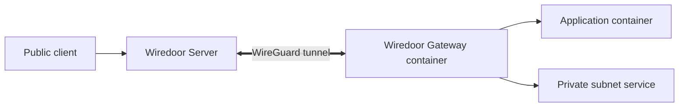

import { Callout, Tabs } from 'nextra/components';

# Wiredoor Docker Gateway

Wiredoor Docker Gateway runs the Wiredoor CLI in a Linux container configured as a Gateway Node. It connects outbound to Wiredoor Server and forwards approved traffic to services on a shared Docker network or a private subnet that the container can reach.

Use it when applications already run in Docker Compose, when several private hosts must share one Gateway Node, or when you need a local Gateway Node on Windows or macOS.

<Callout type="info">
  Native Gateway Node mode depends on Linux `iptables`. On Windows and macOS,
  Docker Desktop can run the Linux gateway container with the required network
  capabilities. The container must still be able to reach the target private
  network.
</Callout>

## How the Docker Gateway Works



Wiredoor Server routes each configured destination subnet through the Gateway Node. Inside the Linux container, Wiredoor applies forwarding and NAT rules between the WireGuard interface and the configured outbound interface.

## Choose What the Gateway Can Reach

| Target                   | Gateway subnet example | Backend host example | Main requirement                                                |
| ------------------------ | ---------------------- | -------------------- | --------------------------------------------------------------- |
| Shared Docker network    | `172.18.50.0/24`       | `app`                | The gateway and service share a user-defined Docker network.    |
| Reachable private subnet | `192.168.50.0/24`      | `192.168.50.20`      | The gateway container can route to the private backend address. |

Docker DNS resolves service names on shared user-defined networks. For a private subnet, use a private IP address or a hostname that the gateway can resolve. The backend does not need to run in a container or share a Docker network with the gateway.

## Requirements

- Docker Engine on Linux, or Docker Desktop on Windows or macOS, with Docker Compose.
- A reachable Wiredoor Server.
- A Gateway Node created in the Wiredoor dashboard.
- The gateway token stored outside the Compose file.
- A target Docker network or private subnet that the gateway container can reach.
- A target CIDR that does not overlap the Wiredoor VPN, Docker networks, or another host route.
- Firewall rules that allow the required backend protocol and port from the gateway path.

## Create the Gateway Node

1. Sign in to the Wiredoor dashboard.
2. Create a node and enable `Is Gateway`.
3. Set the gateway subnet to the network that contains the target services.
4. Set the outbound interface used by the container to reach that network. In a typical Docker deployment, this is `eth0`.
5. Store the generated token securely.

For a shared Docker network, the subnet could be `172.18.50.0/24`. For a private LAN, it could be `192.168.50.0/24`. Use the narrowest subnet that includes the intended backends and verify that it does not overlap another route.

## Configure Docker Compose for Container Services

Define the Wiredoor URL and token in a local `.env` file:

```env filename=".env"
WIREDOOR_URL=https://wiredoor.example.com
WIREDOOR_GATEWAY_TOKEN=replace-with-the-gateway-node-token
```

Keep `.env` outside version control and restrict access to it.

```yaml filename="docker-compose.yml"
services:
  wiredoor-gateway:
    image: wiredoor/wiredoor-cli:latest
    restart: unless-stopped
    cap_add:
      - NET_ADMIN
    sysctls:
      - net.ipv4.ip_forward=1
    environment:
      WIREDOOR_URL: ${WIREDOOR_URL}
      TOKEN: ${WIREDOOR_GATEWAY_TOKEN}
    networks:
      - wiredoor

  app:
    image: nginx:alpine
    restart: unless-stopped
    networks:
      - wiredoor
      - private

  database:
    image: postgres:17-alpine
    restart: unless-stopped
    environment:
      POSTGRES_PASSWORD: ${DATABASE_PASSWORD}
    networks:
      - private

networks:
  wiredoor:
    driver: bridge
    ipam:
      config:
        - subnet: 172.18.50.0/24
  private:
    driver: bridge
```

In this example:

- `wiredoor-gateway` and `app` share the `wiredoor` network, so the gateway can resolve and reach `app`.
- `database` is attached only to `private`, so the gateway cannot reach it directly.
- `app` has no host port mapping. Public access is handled by Wiredoor Server.
- The gateway container requires `NET_ADMIN` and IP forwarding to manage the WireGuard interface and routes.

<Callout type="warning">
  Network membership is an access boundary. Do not attach databases or unrelated
  management services to the gateway network unless Wiredoor must reach them.
</Callout>

## Start and Verify the Gateway

Start the stack:

```bash
docker compose up -d
```

Check the gateway container and its logs:

```bash
docker compose ps wiredoor-gateway
docker compose logs --tail 100 wiredoor-gateway
```

Then confirm in the Wiredoor dashboard that the Gateway Node reports a connected state.

For a container service, inspect the shared network if service-name resolution or routing fails:

```bash
docker network inspect PROJECT_NAME_wiredoor
```

Replace `PROJECT_NAME` with the Compose project name. Confirm that the gateway and target service appear in the container list and that the subnet matches the Gateway Node.

## Route to a Private Subnet

A Docker Gateway can also route to services running on other computers or devices in a reachable private network. For example, a Gateway Node configured with subnet `192.168.50.0/24` and interface `eth0` can forward traffic to an application at `192.168.50.20:8080`.

The application does not need to be part of the Compose project. Before exposing it, confirm that:

1. The gateway container has a route to `192.168.50.20`.
2. The target service listens on port `8080` and accepts connections from the gateway path.
3. Host, router, and application firewalls permit the connection.
4. The private subnet matches the subnet configured for the Gateway Node.

You can inspect the route from inside the gateway container:

```bash
docker compose exec wiredoor-gateway ip route get 192.168.50.20
```

Replace the example address with the real backend IP. A valid route does not prove that the application port is open, so verify the service itself after creating it in Wiredoor.

<Callout type="warning">
  On Windows and macOS, private-network traffic passes through Docker Desktop. A
  host firewall, VPN client, or overlapping Docker subnet can prevent the Linux
  gateway container from reaching the LAN even when the host can reach it.
  Recheck container reachability after changing networks or VPNs.
</Callout>

## Expose a Service

First, create the HTTP service:

1. Select the Docker Gateway Node in the Wiredoor dashboard.
2. Create an HTTP service.

Then set the backend for your environment:

<Tabs items={['Docker network', 'Private subnet']}>
  <Tabs.Tab>
    Set the backend host to `app` and the backend port to `80` for the example
    Compose service.
  </Tabs.Tab>
  <Tabs.Tab>
    Set the backend host to `192.168.50.20` and the backend port to `8080` for
    the example private-subnet service.
  </Tabs.Tab>
</Tabs>

Complete and verify the service:

1. Select a domain that resolves to Wiredoor Server.
2. Add OAuth2 or a tested IP allow list if the application is not intended for unrestricted public access.
3. Open the public URL and confirm that the expected application responds.

Wiredoor Server receives the public HTTPS request and forwards it through the tunnel to the selected backend.

## Troubleshooting

| Problem                              | Check                                         | Resolution                                                                                                 |
| ------------------------------------ | --------------------------------------------- | ---------------------------------------------------------------------------------------------------------- |
| Gateway is disconnected              | Server URL, token, and outbound connectivity  | Correct the value in `.env`, recreate the gateway container, and verify its logs.                          |
| Docker service name does not resolve | Shared Docker network                         | Attach the gateway and target to the same user-defined network.                                            |
| Private backend is unreachable       | Route from the container and target firewall  | Correct the Gateway Node subnet or interface, then allow only the required backend port.                   |
| Backend connection is refused        | Target process and backend port               | Confirm the process listens on the configured address and port.                                            |
| Route uses the wrong subnet          | Docker IPAM, LAN route, and Gateway Node CIDR | Correct the Gateway Node CIDR after checking for overlap with Wiredoor, Docker, host, and VPN routes.      |
| LAN fails only with a VPN enabled    | Docker Desktop and VPN routes                 | Resolve the route overlap or VPN policy, then test connectivity again from inside the gateway container.   |
| Unexpected service is reachable      | Gateway subnet and Docker network membership  | Narrow the routed subnet or separate application networks so the gateway can reach only intended services. |

## Related Documentation

- [Understand Wiredoor Nodes and Tunnels](/documentation/usage/nodes)
- [Configure Wiredoor Services](/documentation/usage/services)
- [Deploy the Kubernetes Gateway](/documentation/gateways/kubernetes)
- [Secure Gateway Nodes](/documentation/operations/security)
- [Troubleshoot Wiredoor connectivity](/documentation/support/troubleshooting)
