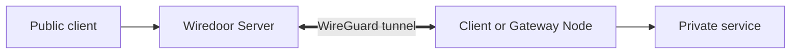

# Wiredoor: Self-Hosted Ingress for Private Services

Wiredoor is an open-source, self-hosted ingress platform for exposing HTTP, TCP, and UDP services from private networks. Remote nodes initiate WireGuard tunnels to a Wiredoor Server, so private services can remain behind NAT or a firewall without accepting direct inbound connections.

## Who Wiredoor Is For

Wiredoor is designed for developers and infrastructure operators who need to publish or remotely access services running in:

- Home labs and private LANs.
- On-premises servers and restricted networks.
- Docker Compose environments.
- Private Kubernetes clusters.
- IoT and industrial networks.

It is a practical fit when you want to own the public entry point, tunnel, routing configuration, and operational data instead of depending on a hosted tunneling service.

## Architecture at a Glance

Wiredoor has three main layers:

| Layer                  | Responsibility                                                                                          |
| ---------------------- | ------------------------------------------------------------------------------------------------------- |
| Wiredoor Server        | Receives public traffic, manages domains and certificates, and routes requests through NGINX.           |
| Client or Gateway Node | Initiates a WireGuard tunnel and provides access to one host or an approved subnet.                     |
| Private service        | Receives forwarded HTTP, TCP, or UDP traffic without being published directly from its private network. |

WireGuard encrypts the connection between remote nodes and Wiredoor Server. NGINX handles public routing and TLS termination for HTTP services. OAuth2 and IP restrictions can be added when a service should not be publicly available to everyone.

Read [how Wiredoor works](/documentation/usage/how-wiredoor-works) for the complete component and request flow.

## Deployment Options

| Component       | Recommended deployment                       | Use when                                                       |
| --------------- | -------------------------------------------- | -------------------------------------------------------------- |
| Wiredoor Server | Docker Compose on a reachable Linux server   | You need the public ingress endpoint and management dashboard. |
| Client Node     | Wiredoor CLI on Linux, Windows, or macOS     | The backend runs on the same machine as the CLI.               |
| Gateway Node    | Wiredoor CLI on Linux, Docker, or Kubernetes | Services are reachable through an approved private subnet.     |

Gateway Node routing depends on Linux `iptables` rules for forwarding and NAT. Native Windows and macOS installations support Client Node mode, but not Gateway Node mode. To operate a local Gateway Node on either system, [run Wiredoor Docker Gateway through Docker Desktop](/documentation/gateways/docker).

## What Wiredoor Provides

- Self-hosted ingress for HTTP, TCP, and UDP services.
- Outbound WireGuard connections from private nodes and gateways.
- NGINX routing for domains, paths, and public ports.
- Let's Encrypt certificates for eligible public domains and self-signed certificates for internal use.
- OAuth2 protection and IP-based access controls.
- A dashboard and CLI for managing nodes and services.
- Optional Prometheus and Grafana integration through the official Docker setup.

## Operational Boundaries

Wiredoor reduces direct exposure of private services, but it does not remove the need to secure the public server and each published application.

- Wiredoor Server must be reachable from the clients and nodes that use it.
- Public DNS, host firewalls, cloud firewalls, and Docker port mappings remain your responsibility.
- Administrative services should require OAuth2 or a restrictive, tested IP allow list.
- Gateway Nodes can reach more than one host and should use the narrowest practical subnet and network policy.
- Self-signed certificates require explicit client trust and are not a substitute for publicly trusted certificates.
- Availability, backups, upgrades, and monitoring remain part of operating a self-hosted deployment.

## Start with One Verified Service

The quickstart deploys Wiredoor Server with Docker Compose, registers one Client Node, exposes one private HTTP service, and verifies the public HTTPS endpoint.

[Install Wiredoor and expose your first private service](/documentation/quickstart)
