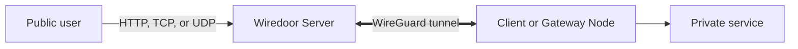

# How Wiredoor Works

Wiredoor provides a public entry point for services that run on private networks. A remote node initiates an outbound WireGuard connection to Wiredoor Server, and the server forwards approved HTTP, TCP, or UDP traffic through that encrypted tunnel.

## Wiredoor Architecture

The private network does not need to accept a new inbound internet connection. The node reaches Wiredoor Server from inside the private network, while users connect to the public server.

## Wiredoor Server

Wiredoor Server is the public control and routing layer. It:

- Provides the management dashboard and API.
- Manages nodes, domains, certificates, and exposed services.
- Accepts WireGuard connections from remote nodes.
- Generates NGINX configuration for public HTTP, TCP, and UDP traffic.
- Sends traffic to the selected node and backend service.

The server must have a reachable public address and the required firewall and Docker port mappings. Wiredoor does not configure the host or cloud firewall for you.

## Local, Client, and Gateway Nodes

Wiredoor uses three node types:

| Node type    | Connection to Wiredoor Server | Services it can reach                                 |
| ------------ | ----------------------------- | ----------------------------------------------------- |
| Local Node   | No remote tunnel              | Services reachable directly from Wiredoor Server      |
| Client Node  | Outbound WireGuard tunnel     | Services running on the same machine as the CLI       |
| Gateway Node | Outbound WireGuard tunnel     | Services inside an approved private network or subnet |

The Local Node is created with Wiredoor Server. Client and Gateway Nodes are registered separately and receive their own WireGuard configuration and access token.

Gateway routing uses Linux `iptables` rules for forwarding and NAT. Gateway Nodes are supported through the Wiredoor CLI on Linux, Docker, or Kubernetes. Windows and macOS installations support Client Node mode only.

See [Wiredoor node types and tunnel behavior](/documentation/usage/nodes) for registration, connectivity, background services, and token lifecycle details.

## Domains and Services

A domain identifies an HTTP or TLS endpoint. A service defines where Wiredoor sends the matching traffic.

- HTTP services use a domain or path and forward requests to an HTTP or HTTPS backend.
- TCP services listen on an approved public port and forward a TCP stream.
- UDP services listen on an approved public port and forward UDP traffic.

Wiredoor does not require a public domain or public DNS. Public domains can use Let's Encrypt certificates when DNS points to Wiredoor Server. Local domains can resolve through an internal DNS server or a hosts file and use self-signed certificates, which clients must explicitly trust.

See [Wiredoor HTTP, TCP, and UDP services](/documentation/usage/services) and [use Wiredoor without public DNS](/documentation/usage/domains-and-dns#use-wiredoor-without-public-dns) for capability details.

## Request Flow

For an HTTP service, the normal request flow is:

1. A user opens the service domain.
2. Public DNS, internal DNS, or a hosts file resolves the domain to Wiredoor Server.
3. NGINX selects the matching domain and path.
4. Wiredoor Server forwards the request through the WireGuard tunnel when the service belongs to a remote node.
5. The node delivers the request to the private backend.
6. The response returns through the same route.

TCP and UDP services follow the same general route, but NGINX selects them by public port and protocol instead of an HTTP domain and path.

## Security and Operational Boundaries

WireGuard encrypts traffic between remote nodes and Wiredoor Server. TLS protects public HTTP traffic when the domain has a trusted certificate. These protections do not replace application security or network controls.

- Protect administrative services with OAuth2 or a tested IP allow list.
- Give each Gateway Node access only to the required subnet and destinations.
- Protect node tokens and rotate them after suspected exposure.
- Patch and monitor the public server.
- Back up persistent data and certificates before upgrades.

Continue with [Wiredoor access control](/documentation/usage/access-control), [deployment security](/documentation/operations/security), or [Wiredoor monitoring](/documentation/operations/monitoring).
